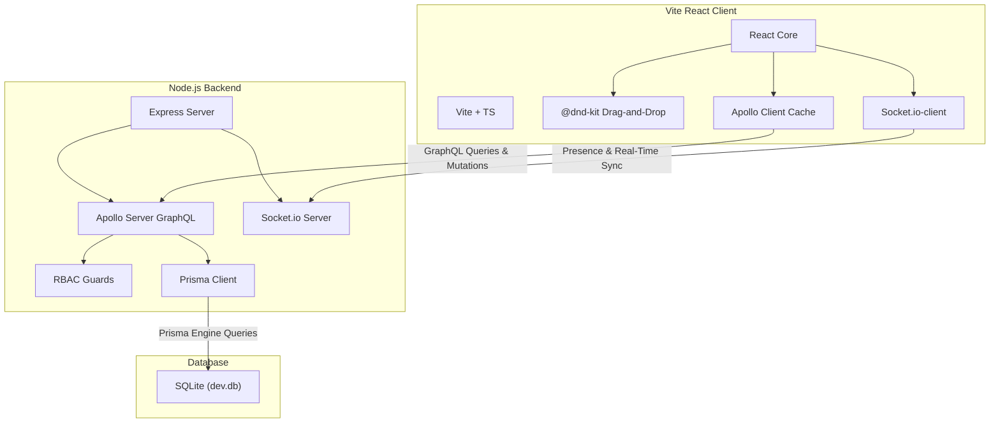

# 📋 KanbanCollab — Collaborative Task Management Platform

A production-grade, real-time collaborative Kanban board (similar to Trello/Jira) designed for team coordination. Built with a modern full-stack TypeScript architecture, implementing responsive glassmorphic interfaces, robust database access constraints, and instant websocket synchronization.

---

## 🌟 Key Features

### 🔒 Secure Authentication & User Settings
- **JWT Session Verification**: Secure login and sign-up with encrypted passwords stored using bcrypt.
- **Context Injection**: Active user parameters are injected into the GraphQL engine context to protect operations.
- **Profile Customization**: Live updates of display names and customizable avatar image links.
- **Password Visibility Toggle**: Show/hide password with a single click for easier entry.
- **Password Strength Meter**: Real-time visual strength indicator during registration (Weak → Excellent, 5 levels).

### 📊 Relational Kanban Workspaces
- **Boards Manager**: Spin up private workspaces or list public boards in custom grid cards with inline edit/delete actions.
- **Board Search & Filter**: Quickly find boards from the dashboard with the integrated search bar.
- **Lane Control**: Dynamic column creation, inline rename via double-click, sorting with positioning coefficients, and deletion with confirmation.
- **Checklist Cards**: Fully customizable task cards featuring titles, descriptions, due dates, priorities, and assigned team members.
- **Label Tagging**: Visual board labels mapping custom HEX colors to classify card domains.
- **Card Conversations**: Threaded comments on task lanes with author-only delete validation safeguards and comment count badges.

### 🔍 Task Search & Filtering
- **Real-Time Search**: Filter visible task cards by title or description as you type.
- **Multi-Criteria Filters**: Dropdown filters for priority level, assigned team member, and label tags.
- **Context-Preserving Dim**: Non-matching cards dim to reduced opacity instead of hiding, preserving spatial board layout.

### ✏️ Inline Editing
- **Task Title & Description**: Click to edit directly in the task detail modal — no separate edit form needed.
- **Priority Selector**: Change task priority instantly via dropdown in the detail modal.
- **Date Picker**: Native date input for setting and updating due dates.
- **Column Rename**: Double-click any column header to rename it in place.

### ⚡ Real-Time Collaboration & Sockets
- **Deduplicated Presence Roster**: Displays a live visual list of avatars currently viewing a board with animated pulse indicators.
- **Optimistic UI Client Cache**: Card swaps and list reordering take effect instantly on the UI without lags, while database operations execute asynchronously in the background.
- **Live Notifications Center**: Instant socket alerts notify users immediately when they are assigned tasks or when comments are added.
- **Dynamic Board Broadcasting**: Column additions, reorder positions, commenting updates, and card removals are synced to all active browsers instantly.

### 🎨 Premium UI/UX
- **Animated Login**: Floating particle background with glassmorphic card, smooth form transitions between Login ↔ Register.
- **Welcome Dashboard**: Time-based greeting hero section ("Good morning/afternoon/evening") with board and notification stats.
- **Toast Notifications**: Elegant slide-in toast system (success/error/warning/info) replacing all browser alerts and confirms.
- **Confirmation Dialogs**: Accessible, focus-trapping confirmation modals for all destructive actions.
- **Tabbed Task Detail Modal**: Organized "Details" and "Comments" tabs with smooth transitions.
- **Micro-Animations**: Staggered card entrance, modal scale-in, page transitions, skeleton loading, and context menu pop effects.
- **Board Card Redesign**: Gradient accent borders, context menus (⋯), and hover lift effects.
- **Column Enhancements**: Priority-colored accent bars, task count badges, and drag grip handles.
- **Overdue Detection**: Past-due tasks display red-highlighted date text on cards.

### ♿ Accessibility (WCAG 2.1 AA)
- **Skip Navigation**: "Skip to main content" link for keyboard users.
- **Focus Management**: Visible focus rings on all interactive elements, focus trapping in modals.
- **Screen Reader Support**: `aria-live` regions for notifications/toasts, `role="dialog"` with `aria-modal`, descriptive `aria-label` on all icon-only buttons.
- **Semantic HTML**: Proper use of `<nav>`, `<main>`, `<section>`, `<aside>`, `<header>`, heading hierarchy.
- **Keyboard Navigation**: Task cards respond to Enter/Space, modals close on Escape, tab-based navigation throughout.
- **Form Accessibility**: All inputs paired with `<label htmlFor>`, proper `autoComplete` attributes, `aria-describedby` for forms.
- **Toggle States**: `aria-pressed` on assignee/label toggles, `aria-selected` on tabs, `aria-expanded` on dropdowns.

---

## 🏗️ System Architecture



---

## 📂 Directory Layout

```
├── docker-compose.yml     # Multi-container orchestration (Postgres, API, UI)
├── README.md              # Document guide
├── client/                # React Vite UI client
│   ├── Dockerfile
│   ├── src/
│   │   ├── components/    # Reusable UI components
│   │   │   ├── Toast.tsx          # Toast notification system
│   │   │   ├── ConfirmDialog.tsx  # Accessible confirmation dialog
│   │   │   └── SearchFilter.tsx   # Task search & filter toolbar
│   │   ├── context/       # Auth & Socket state hooks
│   │   ├── graphql/       # Apollo client links & operations definitions
│   │   └── pages/         # Login, Dashboard, Board Workspace
│   └── tailwind.config.js
└── server/                # Express GraphQL API server
    ├── Dockerfile
    ├── prisma/            # SQLite migrations & schema configurations
    └── src/
        ├── graphql/       # Schema definitions & resolver files
        ├── sockets/       # Sockets room handshakes & broadcasts
        ├── tests/         # Cryptography & Access guards unit tests
        └── utils/         # Authentication & RBAC helper modules
```

---

## 🚀 Local Development Setup

Follow these manual steps to spin up the application manually:

### 1. Backend Server Setup
Create a `.env` file inside the `server/` directory:
```env
PORT=4000
DATABASE_URL="file:./dev.db"
JWT_SECRET="development_secret_signing_key_11223344"
NODE_ENV=development
```

Compile Prisma models and initialize the database:
```bash
cd server
npm install
npx prisma db push
```

Start the Express GraphQL API server:
```bash
npm run dev
```
- **GraphQL playground URL**: `http://localhost:4000/graphql`
- **Websockets listener port**: `ws://localhost:4000`

---

### 2. Frontend Client Setup
Vite is pre-configured to host local client scripts on **port 5180** to avoid conflicts:
```bash
cd ../client
npm install --legacy-peer-deps
npm run dev
```

- **Open Web Browser**: **`http://localhost:5180`**

---

## 🧪 Running Unit Tests
We configure a zero-dependency native assertion testing script to ensure cryptography and access guards execute correctly:
```bash
cd server
npm run test
```

---

## 🐳 Production Container Deployment
To package the stack for multi-container cloud architectures, run Docker Compose from the root workspace directory:
```bash
docker-compose up --build -d
```
- **Live web dashboard**: `http://localhost:8080` (Served over Nginx static proxies)

---

## 🛠️ Technology Stack

| Layer | Technology |
|-------|-----------|
| **Frontend** | React 19, TypeScript, Vite, Tailwind CSS |
| **State** | Apollo Client (GraphQL cache), React Context |
| **Drag & Drop** | @dnd-kit/core, @dnd-kit/sortable |
| **Real-Time** | Socket.io (client + server) |
| **Backend** | Node.js, Express, Apollo Server (GraphQL) |
| **Database** | SQLite via Prisma ORM |
| **Auth** | JWT + bcrypt |
| **Icons** | Lucide React |
| **Deployment** | Docker + Docker Compose + Nginx |
